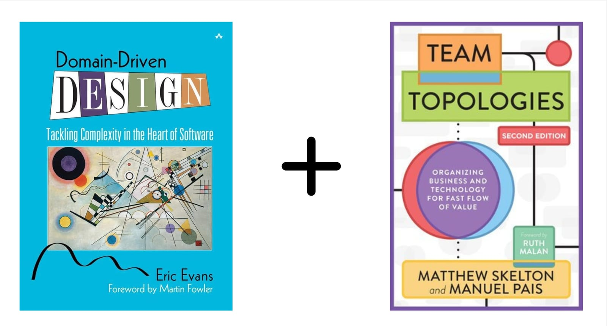
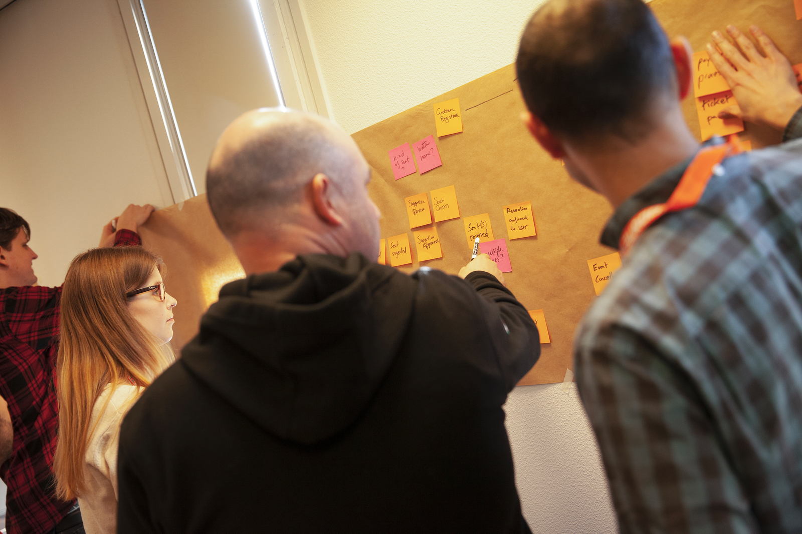
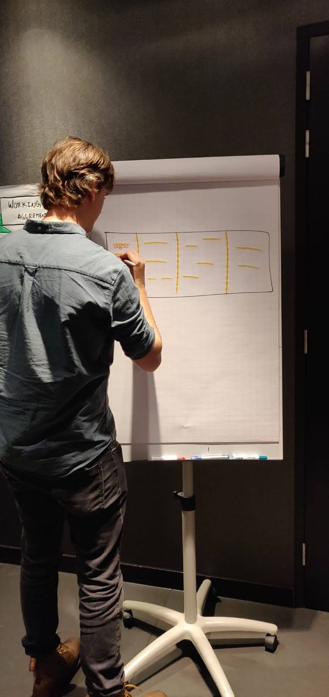

Uncover the power of sociotechnical system design, a holistic approach that optimises teams, architecture, and value streams in harmony. This workshop seamlessly integrates Strategic Domain-Driven Design (DDD) to design resilient, adaptable software architectures with Team Topologies, enabling teams to self-organise for fast flow and embrace full ownership of the software they create. Learn to collaboratively design systems that not only survive but thrive on change, bridging the gap between business needs, software design, and team flow.

---

## About the workshop

This two-day workshop focuses on collaboratively designing value streams, software systems, and teams. You'll leave ready to start designing sustainable and adaptable software products. We'll explore the core principles of Strategic Domain-Driven Design and Team Topologies, immediately applying them to a practical case study. Starting from an outcome of a Big Picture EventStorming session, we’ll context map to distil subdomains, design emergent bounded contexts, and eventually organise teams around those boundaries.

Through hands-on collaborative modelling techniques—including Context Mapping, Domain Message Flow Modelling, Team Interaction Modelling, Bounded Context Canvas, Core Domain Charts, and User Needs Mapping—you'll gain valuable insights and practical experience. This workshop highlights a crucial point: Domain-Driven Design is not solely about technical ability. It's about enabling software builders to actively influence team structures and architectural decisions. We'll also examine how technical leaders can effectively catalyse teams and facilitate organisational alignment. Our comprehensive approach integrates social dynamics with technical details, fostering an environment where teams can truly take ownership of their system's design and architecture.

---

## What you will learn

- **Architecting for Flow-Enabled Teams:** You'll understand how to align teams, architecture, and value streams to significantly improve their delivery flow, resulting in faster feedback from stakeholders and decrease Time to Market.

- **Sociotechnical System Design:** We'll explore the vital role of sociotechnical system design and organisational complexity, highlighting why it's essential to optimise teams, architecture, and value streams in harmony.

- **Strategic Domain-Driven Design Patterns:** You'll learn to use context mapping and strategic patterns to assess your current sociotechnical landscape and understand organisational complexities.

- **Collaborative Modelling Tools:** Get hands-on with diverse collaborative modelling tools, including Context Mapping, Domain Message Flow Modelling, Team Interaction Modelling, Bounded Context Canvas, Core Domain Charts, and User Needs Mapping. These tools help you involve stakeholders and teams throughout the design process.

- **Fundamentals of Team Topologies:** You'll grasp the blockers to flow and team cognitive load, and learn to use Team Interaction Modelling to enable teams to self-organise around business needs.

- **Facilitating Software Design:** We'll equip you to foster an environment where teams actively participate in and take ownership of their software's design and architecture, cultivating commitment and a sense of responsibility.

---

## Before the workshop

To make the most of this workshop, it's helpful to have a couple of years of experience with Domain-Driven Design (DDD) and understand the foundations.=

If you'd like to further prepare in advance, we recommend checking out these resources:

- "Domain-Driven Design: Tackling Complexity in the Heart of Software" by Eric Evans or for a less dense book on DDD you can read "Learning Domain-Driven Design" by Vladik Khononov

- "Team Topologies: Organizing Business and Technology Teams for Fast Flow" by Matthew Skelton and Manuel Pais

We'll also provide introductory materials on both Domain-Driven Design and Team Topologies before the workshop kicks off.

Our workshop is highly interactive, emphasising hands-on learning. For online sessions, we use Miro, a digital whiteboard platform, for collaborative exercises. If you are new to Miro, we suggest taking the self-paced Miro Academy:[ Miro Participant Onboarding Course](https://academy.miro.com/courses/participant-onboarding). This brief course will equip you with the necessary skills to participate in the workshop actively.

## Audience

This workshop is specifically designed for technical leaders deeply involved in software design and architecture. While titles may vary, this includes:

- Software Developers & Engineers with 5+ years of experience

- Tech leads, Staff+ engineers, and Senior software engineers

- Software, Solution, Domain & Enterprise Architects

- CTOs, VPs of Engineering, and Engineering Managers

---

## Agenda

**Day 1**

- The Importance of Sociotechnical System Design

- Decomposing and Distilling Boundaries from a Big Picture EventStorming

- Problem and Solution Space Modelling and Design

- The Impact and Opportunities of Strategic Context Mapping Patterns

**Day 2**

- Connecting Bounded Contexts with Domain Message Flow Modelling

- Strategising and Defining Bounded Contexts with the Core Domain Charts and Bounded Context Canvas

- Categorising Teams Around Domains and Bounded Contexts

- Mapping Stream-Aligned Teams with User Needs Mapping

- Catalysing Decision-Making in an Organisation

