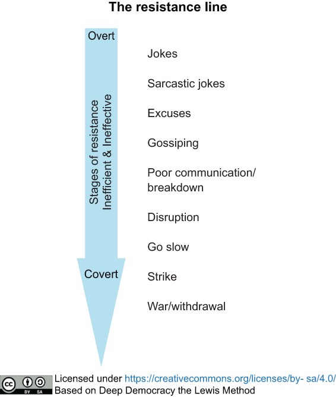
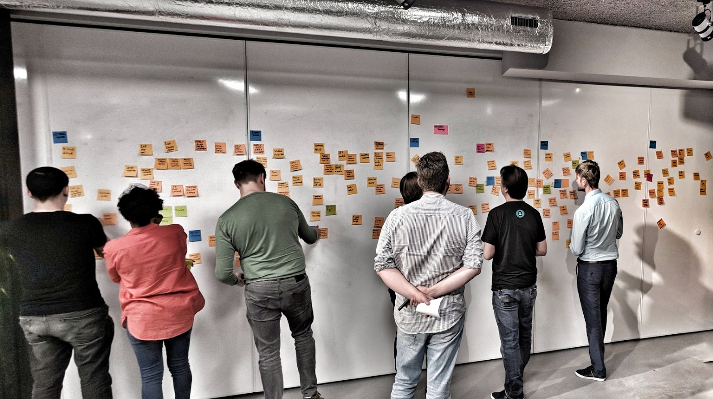

As a Tech Lead, are you finding it challenging to get your entire software team aligned on crucial architectural decisions? Does the team often fall into endless discussions when opinions differ? Do people make assumptions that are proven wrong when implementing? Do you have trouble getting everyone on board with the design?

If you answered yes to some of these questions, this training is designed for you. Learn the facilitation skills needed to lead your team through complex architectural discussions. We will teach you how to overcome resistance, harness collective knowledge, and make decisions that everyone can stand behind. Transform your team's architectural decision-making process, fostering greater ownership, shared understanding, and ultimately, more resilient and sustainable software.

---

## About the workshop

For Tech Leads, making sound architectural decisions that are supported by the whole team, is paramount to successful software delivery. However, navigating diverse technical perspectives, uncovering hidden assumptions, and fostering genuine consensus can be a significant hurdle. This workshop dives deep into the art of facilitating collaborative architectural decision-making within your software team.

We'll equip you with proven techniques to guide your team through complex design challenges, moving beyond technical debates to achieve true alignment. You'll gain insights into how team dynamics, cognitive biases, and constructive conflict resolution can be leveraged to arrive at well-informed and widely supported architectural choices. Learn how to create an environment where concerns are voiced openly and constructively, transforming potential resistance into valuable input. Our core objective is to empower you, the Tech Lead, to make sustainable design decisions by effectively harnessing the collective intelligence of your team, ensuring everyone is on board and committed to the chosen path, with minimizing pushback.

This immersive two-day workshop provides both the theory and hands-on practice you need to master leading collaborative modeling and architectural design sessions. You'll leave with a practical toolkit of strategies and facilitation techniques specifically tailored for Tech Leads to foster inclusive decision-making, manage differing viewpoints constructively, proactively address and mitigate resistance, and ultimately guide your team in building high-quality, sustainable software that everyone is proud to own. Stop facing resistance to your decisions and start facilitating true team ownership of your architecture.

---

## What you will learn

- **Facilitating Decision-Making:** Explore the Tech Lead's dual role in decision-making—both with and for the team. Investigate essential facilitation skills and techniques, and gain clarity on who is best suited to effectively lead these important discussions.

- **The Influence of Ranking:** Understand how both conscious and unconscious rank within a group impact the decisions made, and learn practical techniques to identify these dynamics.

- **Observing Behaviour:** Learn to understand what constitutes behaviour within a group, why observing it is crucial for effective facilitation, and practical methods to enhance group dynamics through mindful observation.

- **Active listening skills:** Learn and practice various active listening techniques, including Socratic questioning and crucial conversations. Develop the ability to ask insightful questions that promote understanding and genuine collaboration, rather than leading the discussion.

- **Check-ins/outs and sense-making:** Understand and experience the value of structured check-in and check-out activities. Learn practical techniques for sense-making to effectively restore flow and cohesion within the collaborative process when discussions become stalled or fragmented.

- **Resistance and Conflict Resolution:** Develop skills to effectively address conflicts and overcome resistance that can hinder collaborative decision-making processes. Learn practical techniques to navigate disagreements and foster a productive environment for collective problem-solving.

- **Making Sustainable Design Decisions:** Learn how optimal software designs leverage the collective knowledge of a group to collaboratively identify and choose the most effective solutions.

---

## Before the workshop

To get the most out of this workshop, prior experience with collaborative modelling is beneficial. If you're looking to prepare further, consider reading our book on [Collaborative Software Design](https://www.manning.com/books/collaborative-software-design?utm_source=baas&utm_medium=affiliate&utm_campaign=book_baas_collaborative_2_1_23&a_aid=baas&a_bid=2f174b8d). We will also provide introductory materials on collaborative modelling before the workshop begins.

Our workshop is highly interactive, emphasizing hands-on learning. For online sessions, we use Miro, a digital whiteboard platform, for collaborative exercises. If you are new to Miro, we suggest taking the self-paced Miro Academy: [Miro Participant Onboarding Course](https://academy.miro.com/courses/participant-onboarding). This brief course will equip you with the necessary skills to actively participate in the workshop.

## Audience

This two-day workshop empowers Tech leads or those wishing to become or make technical or architectural decisions to effectively facilitate collaborative domain modeling sessions for making robust software design decisions. It is ideal for:

- Tech leads, Staff+ engineers, and Senior software engineers

- Software & Solution Architects

- Engineering managers & Team Leads

---

## Agenda

**Day 1**

- What is facilitation, and what is your role as teach lead in decision making

- Techniques for facilitating decision-making

- Understanding the influence of ranking

- Observing behavior: Enhance your situational awareness

- Active listening: Communication and conversation techniques

**Day 2**

- Address a design challenge using your preferred collaborative modeling tool

- Implementing check-in/check-out and sense-making activities

- Strategies for resistance and conflict resolution

- Approaches to making sustainable design decisions

