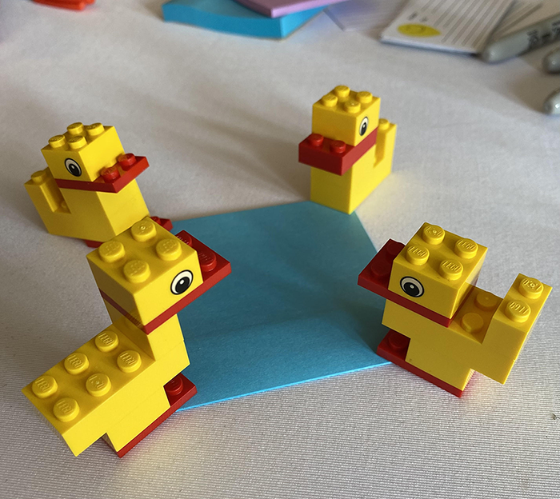

Well, well, well, isn't that a familiar feeling? You're starting on a great journey, and it's so smart to be thinking about who to bring along. Collaborative modeling is all about including as many voices as possible, especially those who can make decisions, those who will be impacted, and those with expertise. And a little secret you especially want to invite the "Harries"—those folks, as Danielle Braun and Jitkse Kramer put it, who see things differently and provide a counter-narrative to the majority. They're golden!

But here's the rub. While you want to go wide and include everyone for discovery sessions, like a big picture event storming, and techniques like "split and merge" or "1-2-4 all or together alone" can help with that, it's not the same when it comes to making decisions. Recent research shows that once a group gets bigger than seven, decisions and performance start to stagger.

So, here's my advice: when you're using collaborative modeling for design activities where you need to make decisions, you want to keep the groups modeling to a maximum of seven people. So, if you have 12 people, you could split them into two groups of six. If you have 16 people, you might have two groups of five and one of six. The beauty of this is that the groups can all model and design the same thing, giving you the bonus of multiple, different alternatives. Afterward, the whole group can share and discuss these alternatives to create one or more possible new, or altered even better, combined solution. From there, the group can consent to a smaller group working out the details and coming back with a proposal for the larger group to make the final decision. 

The sweet spot for effective decisions, remember, is **5-7**. But for discovery, the more the merrier! Just know when to converge and when to diverge, and you'll be well on your way to a successful collaboration.

XoXo, CoMo
