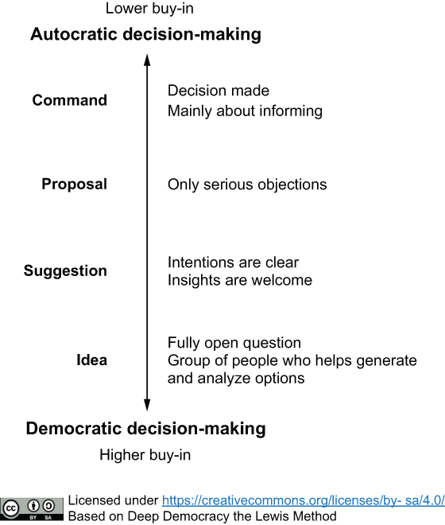

Wouldn’t it be wonderful if everyone simply agreed with every decision? Sadly, that’s not how people—or teams—work. Getting buy-in on design decisions can be challenging, but it boils down to two essentials: clarity and inclusion from the start.

First, make sure everyone understands *how* decisions will be made and *who* will make them. Misalignment often occurs when people think they have influence, only to discover later they don’t. So, be upfront—whether the process is a team vote or a leader’s call, lay it all out clearly.

Next, consider the style of decision-making. While democracy fosters collaboration, it’s not always feasible. Sometimes, a leader needs to make the call, but for autocratic decisions to work smoothly, the team must agree on who has that authority and consent to it. For example, a CTO’s role often grants them decision-making power. But a tech lead without hierarchical authority? That requires explicit group agreement. Without consent, you risk misunderstandings and resistance.

To help with this, there’s a great model included in your book (complete with a handy visual!) that outlines decision-making levels. Sharing this with your team can set expectations and ensure everyone’s aligned.

Regardless of the approach, everyone needs to feel heard. In democratic decisions, once a majority vote is reached, ask those in the minority what they need to support the outcome. For instance, if the team votes for trunk-based development, someone who opposed it might request more knowledge about front-end feature toggles to get on board. Incorporating their input into the decision—Deep Democracy calls this “adding the wisdom of the minority”—can unify the group.

For autocratic decisions, where feedback isn’t naturally built in, ask the group how they feel about the choice and what would help them align with it. Address reasonable concerns where possible. And if you can’t, be honest—false promises are far worse than disappointment. If disagreements persist, it might signal deeper issues needing resolution. The book’s Chapters 8 has excellent guidance for handling such conflicts.

Ultimately, decision-making isn’t just about making the call—it’s about creating a process where everyone feels included and respected. When people feel heard, buy-in becomes much easier. Be sure to read Chapter 9 to know more about making decisions collaboratively!

XoXo CoMo
